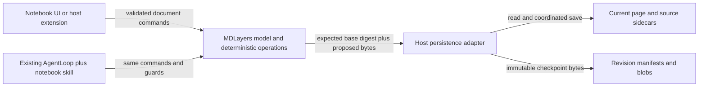

# Notebook data architecture

Status: proposed contract for spec review. The product boundaries are decided; filesystem layout and recovery mechanics require a prototype before implementation approval.

## Tiers and boundaries

The UI edits a working model. The core interprets file formats and coordinates. The host performs authorized filesystem operations. Model output is an input to validation, never a direct disk write. Existing editor models and source documents are not converted to notebook state.

## Store lifecycle

| Store | Writer | Mutability / authority | Read path | Retention / reproducibility |
|---|---|---|---|---|
| Current `.excalidraw.md` page | Compatible host through codec | Mutable authored truth | Core parses original bytes | User-owned; history cannot be reconstructed from latest bytes alone |
| Note-document catalog | Note-document contribution through document manager | Mutable catalog with stable document/section/note IDs, hierarchy, relative page references; no duplicated page content | Host navigation resolves IDs | User-owned; orphan pages stay recoverable without catalog |
| Notes, media, PDF files | Their owning editors | Mutable external authored truth | Resolved references, never implicit notebook rewrites | May change independently; historical reads need archived bytes |
| Ink and review sidecars | Core through host adapter | Mutable authored truth keyed by canvas identity | Sidecar codecs plus placement transform | Move with source identity; preserve unknown fields |
| Revision manifests and blobs | Shared history contract through host adapter | Immutable historical truth; proposed visible `Notebook.history/` directory | Verify manifest dependency closure, then read archived bytes | No automatic pruning initially; never re-render from current dependencies |
| Replay tracks and keyframes | Recording adapter through shared versioned contract | Immutable timed observations linked to base/final revisions; coverage declared | Read-only reducer with archived dependencies | Retention includes chunks/keyframes/blobs; missing tracks do not block current-page editing; see [replay](replay.md) |
| Search index and thumbnails | Host indexer | Derived cache | UI queries tagged by source revision | Rebuildable from corresponding source bytes; do not use as history truth |
| Chat / tool activity | Existing project store and agent events | Existing lifecycle | Existing APIs | Not a substitute for document revisions |
| Undo stack | Notebook editor session | Transient editing state | In-session commands | Durable revisions survive restart independently |

## Save consistency

A new manifest references durable, verified blobs. Incomplete delivery remains explicitly incomplete. The core supplies expected-base digests; a host coordinates local writers and refuses a stale base. Ordinary file sync provides no global compare-and-swap. Keep immutable candidates from competing writers and reconcile them visibly; do not silently pick the latest timestamp.

The exact intent/publication/recovery protocol must be specified and crash-tested before the history feature writes real documents. Preview is read-only. Restore appends a new revision and protects the current state. It must not rewind linked source files used by another page without an explicit source-edit action. Restoring historical dependencies as copies is the default candidate.

## Configuration ownership

| Setting | Plane | Owner / rule |
|---|---|---|
| History capture cadence, storage quota, pruning | Runtime | Notebook history; initial manual checkpoints and no automatic prune, measured defaults before timed capture |
| Storage roots and allowed external references | Runtime | Host adapter; explicit user-selected notebook boundaries |
| Core version, codec fixture versions | Devtime | Package lock and test fixtures |
| Product identity / update feed | Deploy-time | Suite packaging and shared settings |
| Provider and secret references | Existing runtime provider configuration | Reuse provider settings; no notebook-specific secret store |

No network, database, CRDT or native OneNote store is introduced by this contract. Choose extra storage machinery only after measured file-based limitations. Hash algorithms, schema versioning, digest canonicalization, interrupted-save recovery and cross-host write coordination are design gates, not already-shipped guarantees.

## Aggregate revisions

A note document contains multiple notes. A document checkpoint includes its catalog, section/note membership/order and selected page dependency closure. A single-note checkpoint declares its narrower scope. Preview/restore must not confuse restoring one note with reverting the whole document hierarchy. The document manager coordinates these operations; the note-document contribution interprets the catalog.
