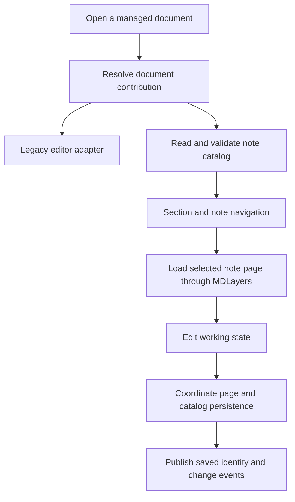

# Document manager and note documents

Status: proposed implementation contract.

## Vocabulary and ownership

A **document manager** opens and coordinates typed documents across the suite. A **note document** is one managed document containing multiple organized **notes**, grouped in ordered **sections**. Each note has an Excalidraw-based page. A **Markdown note** is an external `.md` source that a page may reference; it is not the same entity as a notebook note.

```text
Suite project (existing ProjectStore)
  +-- existing Office / Markdown / PDF / HTML documents
  +-- note document (stable document ID)
       +-- section (stable ID, title, order)
       |    +-- note (stable ID, title, page reference)
       |    +-- note
       +-- section
```

The generic manager owns document-type resolution, stable handles, open sessions, dirty/save/close coordination and lifecycle events. The note-document contribution owns sections, notes, hierarchy validation and its catalog. MDLayers owns page content, layers, marks and coordinate semantics. Existing ProjectStore owns projects and chat. None of these stores duplicates another's authoritative content.

## Proposed portable layout

```text
My Notes/
  Notebook.notebook.json       # identity, ordered sections/notes, relative references
  pages/<note-id>.excalidraw.md # authored page bytes; independent page interoperability
  assets/                     # notebook-owned media; external references remain explicit
  Notebook.history/           # revision manifests and blobs; not dot-prefixed
```

The aggregate entry point is the catalog, not an arbitrary single page. Standalone Excalidraw pages can also open without a catalog. Catalog references stay relative and IDs stay stable on title changes/reorder. Moving an existing external file into a notebook is never an implicit side effect of opening it. The exact catalog schema and suffix are reviewed in the baseline before code.

## Mechanism



```mermaid
sequenceDiagram
    actor User
    participant Manager as Document manager
    participant Notes as Note-document contribution
    participant Storage as Host persistence
    User->>Manager: Open Notebook.notebook.json
    Manager->>Notes: Open validated document handle
    Notes->>Storage: Read catalog and selected page
    Notes-->>User: Organized sections and notes
    User->>Notes: Add a note, then rename and reorder it
    Notes->>Notes: Keep IDs stable; validate hierarchy
    Notes->>Storage: Persist new page before catalog references it
    Storage-->>Notes: Saved state or recoverable error
    Notes->>Manager: Changed/saved event with document and note IDs
```

```text
addNote(document, section):
    validate section belongs to document
    allocate stable note ID; create page in recoverable staging
    persist page successfully
    compare catalog base; publish catalog reference and order
    on conflict: keep recoverable page; do not claim note was added
```

## Required behavior

Open/reopen restores the organized tree and selected note without making tab IDs persistent document IDs. Rename and reorder update catalog metadata, not page identity. Delete offers recovery and respects references; broken or missing pages remain visible in navigation. Duplicate creates a new identity, with explicit copy-versus-reference semantics for assets. Two windows editing one catalog cannot silently lose the other's hierarchy changes.

Search indexes notes and supported page text as derived state; a stale index cannot overwrite authored catalog/content. Document-manager events carry document/note identities to project/chat, AI context and history. Save/Save As/close commands coordinate dirty notes and unsaved catalog changes, including cancellation and disk failure.

For ordinary documents the manager delegates to existing editor entry points; it does not translate their formats into note pages. Their tabs and file behavior are regression-tested. A linked workbook/PDF can be opened in its original editor and return to the note with refreshed reference state.

## Persistence boundary

A page/catalog pair is not made atomic merely by writing two files. A new page is published before a catalog points to it; orphan recovery covers crashes between those steps. Rename/delete and multi-note moves need a specified recovery protocol before implementation. Revisions of a note document include its catalog and note membership, not merely the active canvas. Shared dependency restore follows the data-architecture contract.
