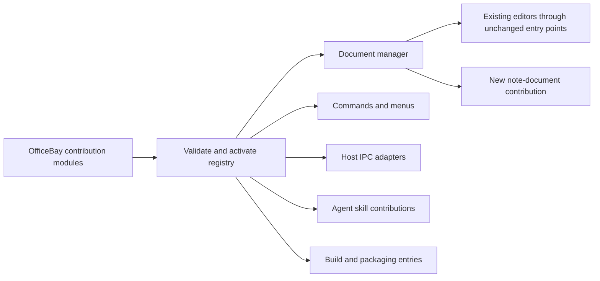
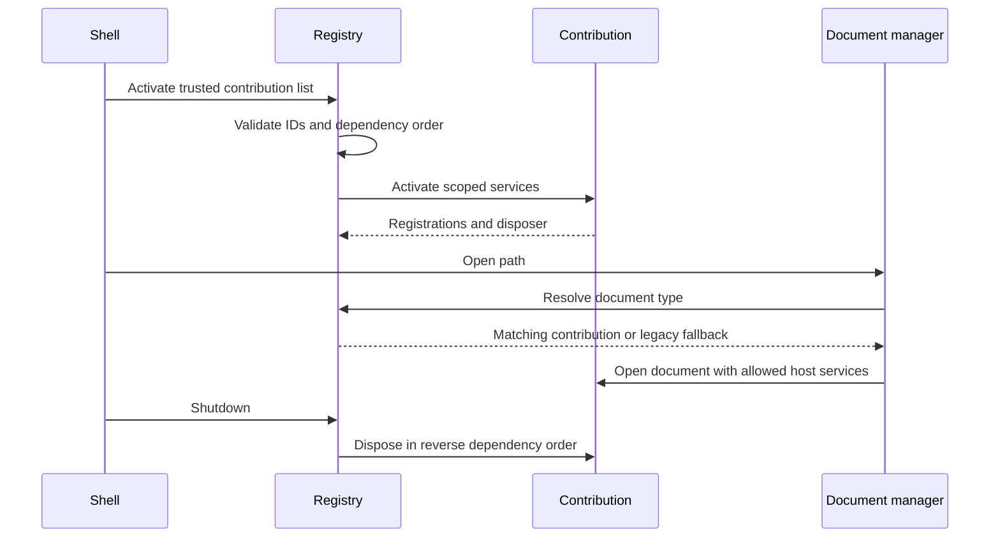

# Extension mechanism

Status: proposed implementation contract. The goal is to add capabilities through OfficeBay-owned contributions while leaving GenOffice editor code alone.

## Existing and missing seams

| Surface | Existing owner | Current mechanism | Addition needed |
|---|---|---|---|
| File routing | `apps/shell/src/main/index.ts`, `routeDocumentPath` | Ordered format checks | Contribution resolver before legacy fallback |
| Tab identity and lifecycle | `apps/shell/src/shared/tabs-api.ts`, `tab-manager.ts` | Closed TabKind union, per-app creation and dirty/close paths | Extension document handle with lifecycle callbacks |
| Menus, shortcuts, new/open/recent | Shell main and renderer | Per-kind branches and icon tables | Commands/menu/icon contributions bound to active document capabilities |
| Preload and IPC | Shell/app preload and shared API modules | Explicit channel registration | Namespaced, validated contribution APIs with disposal |
| Build and packaging | Workspace manifests, shell Vite/builder config | Explicit app inputs/assets/dependencies | One repeatable build contribution list; no manual copy per new type |
| Project and chat | `packages/project-store` | Shared project/file/chat APIs | Adapter from stable document identity; do not duplicate the store |
| AI tools | `AgentSkill`, `composeSkills`, `AgentLoop` | Composable tools/context, duplicate-name checking | Notebook skill registration and validated document-command access |
| Models and codecs | `packages/*` | Reusable engines with format ownership | One MDLayers package; codec/mark-kind registration |
| Provider capabilities | `packages/ai-provider` and callers | Shared provider stack plus hosted paths | Independent capability adapters, no second provider system |
| Settings, i18n, theme | Shared UI/i18n/settings owners | Shared conventions, explicit per-app wiring | Namespaced keys, existing tokens and setting ownership |
| Import/export/search/history | Existing format owners; new notebook owners | Format-specific implementations | Capability interfaces and contribution dispatch; no duplicate central engine |

This is a map of integration work, not a claim that a plugin framework already exists. CodeGraph verified the router, tab union, lifecycle class and agent composition. Baseline work must finish the caller/build/IPC audit before changing these surfaces.

## Proposed contribution lifecycle

Start with trusted, build-time TypeScript contributions. Each declares a stable ID, dependencies, document types, commands, views, supported services, settings and lifecycle hooks. Separate pure definitions from Electron implementation. Runtime downloading of arbitrary plugin code and a plugin marketplace are not prerequisites.

A registry validates contribution IDs and dependencies at startup, orders activation, and owns disposal. Duplicate IDs and ambiguous file matches are errors. File matching chooses the most specific declared suffix before generic suffixes; an equal-priority tie is reported rather than resolved by registration order. Existing formats remain the legacy fallback.





```text
activate(contributions):
    validate unique IDs and dependency graph
    for contribution in topological order:
        bind scoped host services; activate; retain disposer
    if activation fails: unwind completed activations; report failed contribution
resolve(path):
    matches = validated contribution matchers(path)
    choose unique most-specific match; reject unresolved tie
    if none: use existing legacy routing
```

## Isolation and cross-cutting behavior

Commands and AI tools use one document-operation boundary. Contributions receive permitted service handles, not raw access to unrelated editor state. IPC checks sender/document identity and validates payloads. Capture mutation/revision events at that boundary so a new mark kind cannot bypass locks, expected-base validation or history. Tracing observes the same operation ID from command through persistence.

New marks, codecs, exporters and provider adapters register their behavior; adding one should not grow a switch inside legacy code. UI contributions name their document capabilities so commands disable honestly when unavailable. Cancellation and disposal remove listeners, close resources and stop owned work.

## One-time bridge boundary

A zero-edit integration into today's hardcoded shell is not established. Plan a small, reviewed bootstrap bridge in shell routing, tab lifecycle, shared tab types, preload and build inputs. Keep it in named commits with regression tests. Do not change `apps/markdown`, `apps/docs`, `apps/sheets`, `apps/slides`, `apps/pdf` or `apps/html` editor implementations to host the notebook.

After the bridge, adding a demonstration document contribution must require only new contribution code and its build registration. Repeat with a new command/mark kind to prove the mechanism rather than declaring extensibility from an interface. Any extra legacy edit needed by the real notebook is a failed extension-contract test that must be resolved before proceeding.
