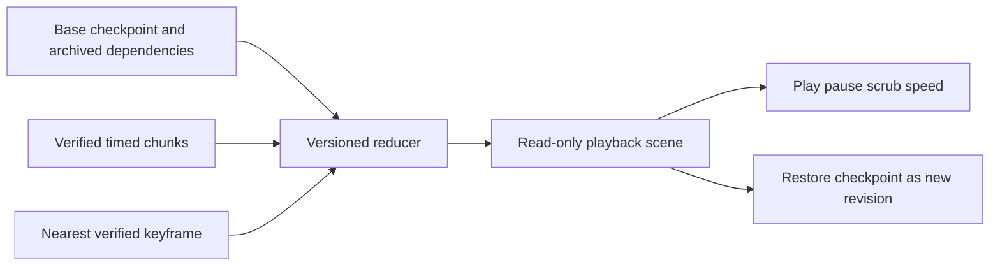

# Recorded replay and Excalidraw pages

Status: proposed shared-core contract; no replay implementation exists. The isolated UI prototype demonstrates interaction only.

## Two persisted products of an edit

A normal `.excalidraw.md` page stores the latest editable scene. Immutable snapshots support recovery and historical preview. A timed recording adds the order and duration of observed author actions. Snapshot differences cannot recover pen speed, pauses or intermediate edits.

[OneNote research](../research/onenote-revisions.md) supplies revision identity, dependency reuse and publication ideas. Its cited structures do not establish a gesture stream. Excalidraw's [inspected free-draw type](https://github.com/excalidraw/excalidraw/blob/97c68dd371e13c017a8dcca49f8b3995ba7890a8/packages/element/src/types.ts#L430) stores geometry/pressure without per-point time. OfficeBay needs an additional capture channel; this is not a claim that no community animation tool exists.

## File integration

```text
My Notes/
  Notebook.notebook.json                 # stable IDs and relative references
  pages/<note-id>.excalidraw.md           # current scene, editable without replay
  assets/
  Notebook.history/
    revisions/<revision-id>.json         # immutable checkpoint/dependency manifest
    blobs/<digest>                      # original page/sidecar/dependency bytes
    replay/<track-id>/manifest.json      # base revision, chunks, final revision
    replay/<track-id>/<chunk-id>.json    # immutable timed events
```

The catalog associates stable page IDs with history/tracks. For standalone pages, optional namespaced frontmatter is a candidate locator, subject to real Obsidian preservation tests. Keep the Drawing-section schema compatible; avoid an ever-growing event log in element customData. Preserve unknown metadata. A copied page remains editable without history; show replay unavailable. Bundle export includes tracks and referenced blobs. Save As/duplication allocate distinct page/track identities with provenance; rename updates paths while retaining identity. Detached-page discovery/frontmatter survival remain experiments.

## Recording contract

The user starts an explicit recording session with visible status. Capture accepted commands and pointer samples before stroke simplification discards time. Unrecorded intervals retain checkpoint history without a timing promise.

Start establishes a verified base checkpoint before accepting a complete track. During capture, flush bounded chunks and expose unsaved recording state. Stop/save publishes final scene/dependencies and a final checkpoint, then marks the track complete only after validating its reduced result. A failed flush leaves an incomplete track and recoverable page; it must not report successful durable recording. Chunk cadence and size require measurement rather than per-pointer-event disk writes.

| Record | Required meaning |
|---|---|
| Track manifest | Schema/reducer version, document/page IDs, actor/session, base revision/digest, ms time unit, ordered chunk digests, final revision and coverage |
| Event envelope | Session-local sequence, monotonic elapsed time, target ID, operation and validated payload; wall-clock time is descriptive |
| Ink | Stable stroke/element, canvas and layer IDs; placement context, coordinates/pressure/time; tool and geometry version |
| Other mutations | Create/update/delete, text commit, transform, layer change, erase and undo/redo results; identities and dependency versions |
| Keyframe | Verified state at a sequence boundary, dependency closure and reducer version for faster seeking |
| Gap | Before/after checkpoints, reason and known time bounds; unknown duration stays unknown |

Text appears at recorded commit boundaries unless finer capture is deliberately implemented. Agent batches produce validated command events with attribution. Optional viewport/cursor motion belongs to a presentation track. Erase/undo are explicit operations so replay shows the earlier stroke and later removal. Rejected/locked actions do not mutate recorded state.

The shared model owns coordinates and event reduction. Browser adapters capture pointer/coalesced samples; hosts map clocks and persist chunks. Point times are relative to stroke start, event times to session start. Preserve raw samples; derive engine geometry with a pinned transformation. Do not infer timing from element updated timestamps.

## Worked ink example

A stroke starts 1000 ms into a session. Samples arrive 0, 20 and 60 ms after stroke start. At playback time 1030 ms the first two samples are committed; an in-progress tip may interpolate within the recorded interval. The normal saved scene contains completed geometry. The separate track records:

```json
{
  "schemaVersion": 1,
  "seq": 12,
  "tMs": 1000,
  "kind": "ink.stroke",
  "targetId": "stroke-7",
  "canvasId": "page-a",
  "layerId": "ink",
  "durationMs": 60,
  "samples": [[10, 20, 0.4, 0], [13, 22, 0.5, 20], [19, 24, 0.6, 60]]
}
```

This illustrates units/identities, not a frozen production schema. Handwriting's measured tuples can supply genuine stroke timing. They do not prove complete edit history: later erasures/moves/text edits may be absent. Imported tracks declare coverage. Preserve source-coordinate ink and apply placement transforms when rendering.

## Playback and recovery



Seeking loads a prior keyframe, reduces completed mutations and samples up to the requested time, then renders in-progress ink. Order by session-relative time with sequence/sample index as deterministic tie-breakers. Overlapping strokes/actions need explicit ordering; keyframes include active-stroke state or occur at quiescent boundaries. Repeated seek/play yields the same state. Use archived assets and versioned rendering profiles; cross-platform pixel equivalence needs measured tolerances. Playback uses a separate scene and does not write the live page. Restore targets a verified checkpoint, not an uncommitted half-stroke. Creating a new checkpoint from intermediate playback is a later explicit capability.

After an external edit, compare the page digest with the track's expected state. Preserve both states and append a labeled snapshot transition/gap or start a new segment. Jump to the next known checkpoint; do not invent plausible drawing motion. Two devices create branches selected explicitly, rather than merged by clock order. Missing chunks show incomplete recording while the final scene stays usable.

Follow the [revision publication contract](data-architecture.md): verified dependencies before complete publication, retained conflicting candidates and crash recovery without assumed distributed atomicity. An interrupted stroke is partial only if samples were durably captured; otherwise show a capture gap. Retention reachability includes chunks, keyframes, base snapshots and assets. Pruning previews lost replay coverage; saving does not silently truncate tracks.

## Acceptance experiments

- Capture pressure/time through restart; compare reduced final state with saved scene under a documented canonical comparison excluding nondeterministic host metadata.
- Play/pause/seek between samples at 0.5x/1x/2x; verify deterministic state and unchanged live-file bytes.
- Record transform, erase, undo, text commit and agent mutation; verify visibility/lock and source placement.
- Import timed Handwriting and geometry-only Excalidraw; edit externally in Obsidian. Labels distinguish measured animation, discrete states and unknown intervals.
- Inject crash/missing chunks/delayed sync; branch across hosts, rename/copy/export and prune. Recover current pages independently of replay.
- Measure long-session memory, chunk size, seek latency and keyframe spacing before selecting limits/defaults.

Sprint 02 settles capture/compatibility experiments; 08 exposes time-preserving events; 09 implements recording/playback; 11 proves host coverage. The [UI design request](claude-ui-design-request.md) specifies controls and gap states.
