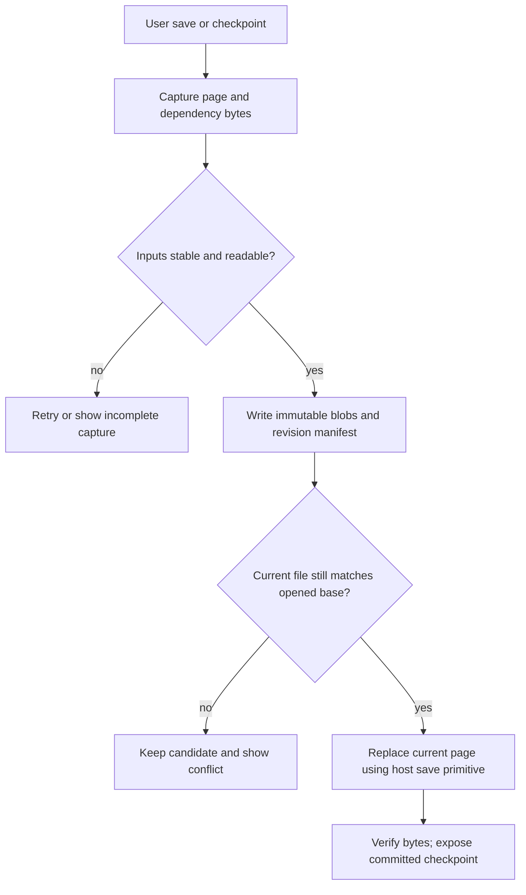
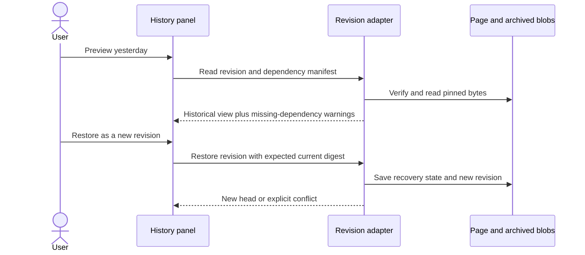

# OneNote revisions and what OfficeBay can borrow

Date: 2026-09-21. Scope: official file-format documentation and the checked-in GenOffice seams. This is not a native OneNote reader/writer prototype or a measurement of OneNote's save frequency.

## What a revision store is

A `.one` file is a structured store, rather than a ZIP of Office XML parts. Object spaces group related objects; objects hold properties and references. A revision identifies an immutable state of one object space, including its roots and reachable objects. The same revision identity must resolve to the same state. [Microsoft: Revision](https://learn.microsoft.com/ja-jp/openspecs/office_file_formats/ms-onestore/a8ca2a90-d92a-4cf7-bf68-ed18ae476a11).

A revision manifest can depend on a previous revision and override selected objects. That makes unchanged state reusable: resolving a revision combines the dependency's state with its replacements. It is a representation of state, not necessarily a replayable list of user gestures. [Microsoft: Revision Manifest](https://learn.microsoft.com/en-us/openspecs/office_file_formats/ms-onestore/90101e91-2f7f-4753-9332-31bed5b5c49d).

Writes also have a transaction boundary. New file nodes are appended; a header transaction count identifies which transactions are committed. Readers ignore later, uncommitted additions. This guards against seeing a half-written change. It does not by itself implement multi-user merging. [Microsoft: Transaction Log](https://learn.microsoft.com/pt-br/openspecs/office_file_formats/ms-onestore/ed4febfd-4893-4719-9ca9-66924f2fb287).

## Three different kinds of history

| Mechanism | Meaning | OfficeBay consequence |
|---|---|---|
| Storage revision | Immutable state with a revision identity | Keep a stable reference to exactly what was saved |
| User-visible page version | A particular historical page represented separately from the default current context | Decide which checkpoints the history panel exposes |
| Conflict page | A separate representation of conflicting content | Keep competing edits inspectable; do not discard a losing writer |

OneNote explicitly describes version-history pages, separately from storage revisions. Therefore an internal revision is not evidence that the user can browse every keystroke. [Microsoft: Version History Page](https://learn.microsoft.com/en-us/openspecs/office_file_formats/ms-one/9d9201e8-6533-4587-9aeb-28b645f8aec1).

It also specifies conflict pages, including read-only conflict content associated with its parent page. This establishes a conflict representation; the cited format section does not specify the complete synchronization/merge algorithm. [Microsoft: Conflict Page](https://learn.microsoft.com/en-us/openspecs/office_file_formats/ms-one/131c1b53-c611-4aa6-b2c5-72f3129d9365).

## Worked example

You type a paragraph and insert an image. Call that page state A. You add ink: state B reuses unchanged objects from A and replaces the affected object state. You later restore A: a history feature should create a new current state C representing the older content, retaining B for inspection. The last step is our proposed restore policy, not a claim about Microsoft's implementation.

If another device edits A while this device edits B, there are two descendants. A parent pointer detects that relationship; it does not decide which edits commute. Keep both candidates and require an explicit resolution until a tested merge algorithm exists.

## Apply the ideas to Excalidraw pages

The chosen file format remains `.excalidraw.md`. A separate, non-dot-prefixed history directory can hold immutable snapshots and manifests. Recovery uses full byte snapshots with content-addressed deduplication. Animated replay additionally needs versioned timed events; snapshots alone do not retain gesture timing. The [replay contract](../design/replay.md) defines recording, coverage gaps and file integration. Snapshot recovery remains usable independently of event-reducer availability. Storage deltas can be measured later.

A revision manifest records page identity, parent revision, authored page bytes, layer/ink/comment sidecars, referenced dependency versions, actor, reason, and timestamp. The blobs preserve unknown fields and compression exactly. A manifest is browsable only after every required blob exists and passes its digest check. A synced manifest arriving before its blobs is shown as incomplete, not corrupt current content.

A page-only snapshot is insufficient: yesterday's page could otherwise display today's linked note or PDF. A complete checkpoint pins the local dependency closure. External URLs are recorded as unpinned unless captured; the UI must say historical fidelity is partial. Reaching missing or unreadable dependencies must not silently relabel a partial checkpoint as complete.

Preview reads archived bytes. Restore creates a new revision. It does not overwrite a shared source note or PDF to rewind one page: materialize selected historical dependencies as new copies, or retain explicit versioned references supported by that host. The implementation must prove compatibility with Obsidian before choosing the latter.

## Proposed save and restore flow





```text
checkpoint(page, openedBase):
    capture page and local dependency closure using stable before/after fingerprints
    persist immutable blobs; verify digests
    persist candidate manifest with parent = openedBase.revision
    inside the local host's write coordination:
        if current page digest != openedBase.digest: retain candidate; return conflict
        publish the page using the host's proven atomic replacement primitive
        verify resulting bytes; record successful publication
    return checkpoint
```

The local coordination above is not a distributed lock. Synology, another host, or an editor that ignores the lock can race it. Preserve uniquely named immutable candidates, detect forks/conflict copies on reconciliation, and test that neither history branch is lost. Do not claim fully atomic multi-file or cross-machine commits from a rename. Exact recovery ordering is a required design/prototype task before revision implementation.

## What already exists here

`AgentLoopOptions.captureSnapshot` and `onToolExecuted.snapshotBefore` in `packages/agent-core/src/loop.ts` expose rollback capture around agent mutations. `AgentSkill` supplies context, tool definitions, execution and response verification. These are reuse seams, not evidence of durable notebook history. `packages/project-store/src/types.ts` defines chat and project metadata; a chat timeline is not a page revision store. CodeGraph identified these owners at repository base `9df040e`.

## Recommendation and remaining research

Adopt immutable checkpoint identity, an explicit publication boundary, and visible conflict branches. Keep undo/redo, durable revisions, sync and AI activity logs as distinct features. Initial retention should be explicit/manual until size measurements justify a pruning policy; garbage collection must preserve all blobs referenced by retained revisions or unresolved conflicts.

Before implementation, measure large PDF/image checkpoint cost; inject crashes at publication boundaries; test simultaneous OfficeBay/Obsidian writes and delayed Synology delivery; confirm dependency-copy restore semantics. Native `.one` import/export and live collaborative merge are separate, unrequested capabilities. This research does not establish either.
