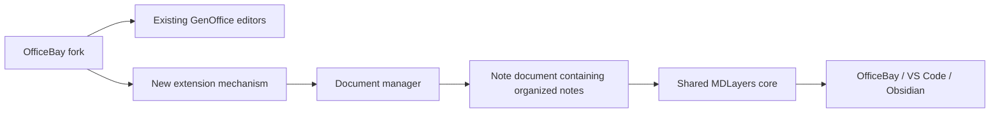

# 01 - Fork foundation

## Mental Model & Invariants

Keep GenOffice's existing document editors. Add an extension mechanism, a document manager and a separate note-document type containing organized notes, with an Excalidraw/MDLayers core. White-label the suite. This foundation delivers a map and provenance, not notebook implementation.

## Requirements

- R1: The repository SHALL identify its origin, upstream, baseline and local Windows working copy.
- R2: The foundation SHALL distinguish existing implementation from planned additions and name each owner.
- R3: The plan SHALL preserve existing editor behavior and explicitly bound one-time shell integration edits.

## Design

The fork owns new packages and contributions. Existing editors stay available through their current entry points. The extension mechanism supplies the future attachment points; the document manager coordinates documents; the new note-document contribution owns organized notes. The shared MDLayers package supplies portable page/mark semantics.

| Existing implementation | Planned addition |
|---|---|
| `apps/{docs,sheets,slides,pdf,markdown,html}` | Separate `apps/notebook`; no notebook features inserted in those editors |
| Explicit shell router, TabManager and TabKind | Contribution registration and document lifecycle adapters |
| `packages/project-store` project/file/chat APIs | Generic document manager plus note-document section/note catalog |
| `packages/agent-core` and `packages/ai-provider` | Notebook AgentSkill and independent replacements for hosted capabilities |
| Format engines and shared UI/i18n utilities | Shared MDLayers codec/model, notebook UI, layers and mark registry |
| Session/agent snapshot hooks | Durable note-document revisions and conflict recovery |
| Suite packaging and existing test suites | OfficeBay identity, endpoint guard and complete parity evidence |
| MDLayers design and measurements | One reusable core implementation plus three host adapters |



```mermaid
sequenceDiagram
    actor Owner
    participant Map as Foundation map
    participant Source as Repository source and CodeGraph
    Owner->>Map: Preserve existing editors; add note documents
    Map->>Source: Inspect existing owners and extension seams
    Source-->>Map: Implemented owners and missing boundaries
    Map-->>Owner: Current map and ordered DRAFT queue
```

## Tasks and Checks

- [x] T1 (R1): Origin is `kundeng/officebay`; upstream is `genspark-ai/genoffice`; branch `officebay/main`; Windows working copy `officebay-win`. Provenance remains in `references/genoffice.md`.
- [x] T2 (R2): Map implemented/planned owners above, with source-grounded detail in `docs/design/feature-parity.md` and `extension-mechanism.md`. CodeGraph inspected router, tab types/lifecycle and agent composition.
- [x] T3 (R3): Record the separate note-document boundary in `docs/design/notebook-contract.md` and prepare the ordered queue.

## Completion Boundary

Closed as a documentation foundation. No notebook, extension registry or document-manager implementation is claimed. Application behavior and feature completeness are verified in the later baseline and implementation sprints. Source anchors: `apps/shell/src/main/index.ts`, `apps/shell/src/main/tab-manager.ts`, `apps/shell/src/shared/tabs-api.ts`, `packages/agent-core/src/skill.ts`, `packages/project-store/src/index.ts`.
