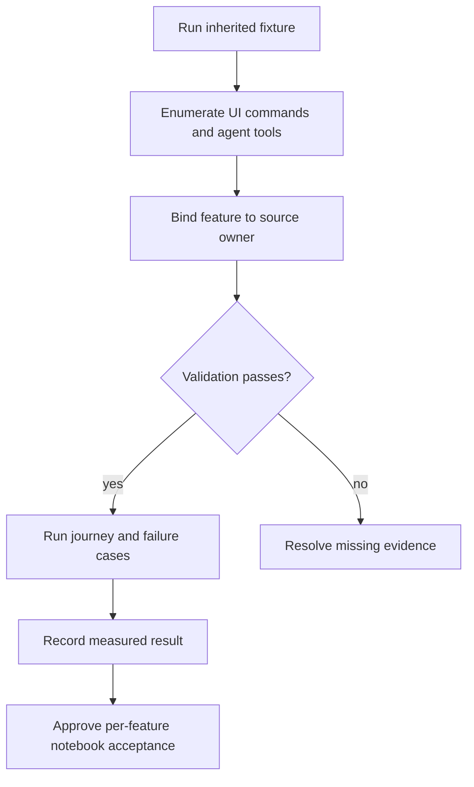
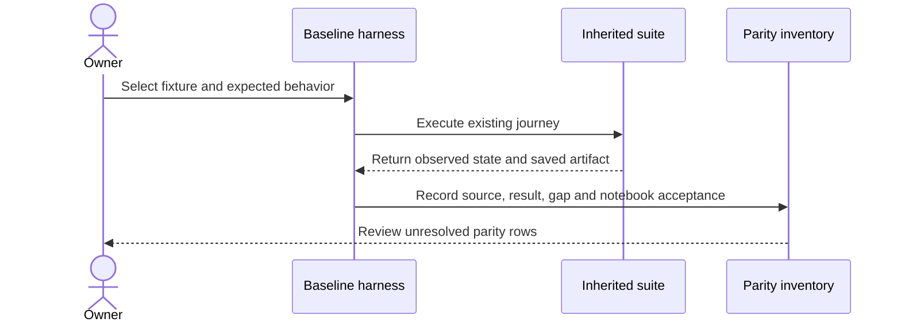

# 02 - Baseline the separate notebook and enumerate parity

## Mental Model & Invariants

Conforms to `docs/design/notebook-contract.md`. Add a separate OneNote-like notebook using Excalidraw-based pages and one shared MDLayers core; preserve existing document editors and user files. The owner selected that frame on 2026-09-21. This sprint remains DRAFT until its baseline dependencies and implementation design are ready.

Pillars advanced: P1, P6. Canonical shared-state rules: `docs/design/data-architecture.md`. Source-grounded capability inventory: `docs/design/feature-parity.md`.

## Requirements

- **R1:** WHEN a parity claim is made, the baseline SHALL name the source command, fixture, result and notebook acceptance check, including negative paths.
- **R2:** WHEN the notebook is integrated, its shell routing, persistence, UI and agent boundaries SHALL be named without repurposing an existing editor.
- **R3:** BEFORE implementation, notebook hierarchy, rich text, references, shared-core release consumption and revision scope SHALL have reviewed contracts.
- **R4:** WHEN the old research is reused, claims SHALL be checked against current code and the owner-selected notebook journey.

## Out of Scope

Only fixtures, baseline harness, evidence and specs. No feature implementation or upstream rebase.

## Design

### End-to-End Walkthrough

The owner opens the inherited suite and follows representative document journeys. The resulting baseline and command inventory define exactly what the separate notebook must preserve and add. No existing editor is changed.

### Ownership and Configuration

Existing source is read-only; baseline test additions use `e2e/` and per-package tests. No new runtime configuration.

All production boundaries require typed validation. Existing source locations are candidates grounded in the baseline, not permission for broad edits. Each implementation task records its exact source paths and tests before writing. Shared state conforms to the anchor rather than maintaining a second schema here.

### Workflow



### Sequence



### Algorithm

```text
collect commands, tools and MDLayers requirements
for each capability: bind source + notebook behavior + owner + proving fixture
if missing evidence: retain unresolved status
block parity approval until unresolved scope decisions are reviewed
```

### Failure and Verification

No task may turn an untested compatibility claim into a passing result. Use non-private fixtures and scratch documents. Include stale input, missing dependencies, malformed data, cancellation or interrupted writes wherever the boundary applies. Code changes use relevant unit/integration checks plus the real host journey; documentation-only analysis uses source and graph validation.

## Tasks and Acceptance

- [ ] **T1 - baseline (R1).** Expand every G/M/R family in the parity inventory into individual rows; record untested features as untested. Run inherited open/edit/save/reopen, AI cancellation and print/export checks on Windows.
  Acceptance: Every menu/tool/setting family is covered or explicitly unresolved; no inferred pass.
- [ ] **T2 - seams (R2).** Use CodeGraph to trace TabKind, routeDocumentPath, tab lifecycle, build/preload wiring, project APIs and agent contracts; record exact allowed integration files.
  Acceptance: Notebook compound suffix wins before Markdown; plain Markdown retains its original route.
- [ ] **T3 - contracts (R3).** Resolve notebook catalog shape, stable IDs, sidecar ownership, content compatibility and expected-base saves; annotate each remaining design question with its proving experiment.
  Acceptance: Each state boundary has a schema owner, read path and failure behavior; no unowned store.
- [ ] **T4 - reconcile (R4).** Refresh the owner inventory and select note-document fixtures including rich text, math, printouts and multiple organized notes.
  Acceptance: The inventory matches the current note-document direction and records untested inherited journeys.

- [ ] **Review gate.** Reconcile requirements - tasks - evidence and check S1-S13/Q1-Q7 as applicable. Record each deviation; update the parity matrix, guides and pillar facts. Close only after its own walkthrough and failure checks pass.
