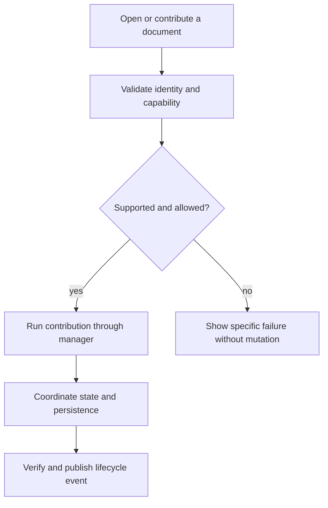
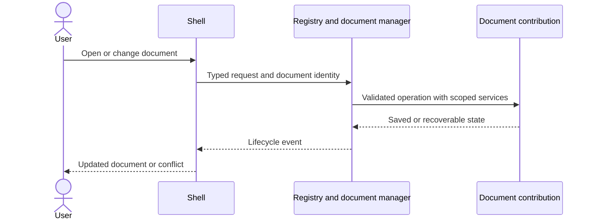

# 03 - Map and implement extension contributions

## Mental Model & Invariants

A separate note document contains multiple organized notes. Existing GenOffice editors stay intact. New behavior attaches through OfficeBay contributions. Conforms to `docs/design/notebook-contract.md`, `extension-mechanism.md` and `data-architecture.md`. This is a DRAFT implementation plan; no new feature is claimed implemented.

## Requirements

- R1: BEFORE building the bridge, the extension inventory SHALL trace routing, tabs, menus, IPC, build, project/chat, agent tools, settings, codecs, history and exports to their owners and callers.
- R2: WHEN contributions activate, IDs/dependencies SHALL be validated, ambiguous matches rejected, activation failures unwound and resources disposed.
- R3: WHEN a new contribution is added after the bridge, it SHALL require no edits to GenOffice editor implementations or repeated shell dispatch branches.
- R4: WHEN a command mutates a document, the same typed operation boundary SHALL enforce identity, permitted scope, cancellation, locks and expected-base state for UI and AI.

## Out of Scope

Notebook canvas editing, white-labeling, native OneNote storage and untrusted dynamically downloaded plugins. No replacement project/chat store and no modifications to existing editor internals.

## Design

### End-to-End Walkthrough

A developer registers a small new document type, command and mark kind. They appear through the shell without further edits to an existing GenOffice editor. Removing the contribution releases its listeners, views and commands.

### Components and State

The named design anchors own the cross-cutting contracts. New OfficeBay packages implement these responsibilities; exact package names are settled in baseline. The host bridge is a bounded integration surface, not permission to refactor all format apps. New catalogs and identity schemas are reviewed before implementation. Existing documents remain in their original formats.

### Workflow



### Sequence



### Algorithm

```text
validate contribution manifest and dependencies
activate in dependency order; retain disposers
resolve by explicit file specificity; reject ties
dispatch through scoped typed services
on shutdown/failure: dispose in reverse activation order
```

### Configuration and Verification

Contribution lists/package versions are devtime inputs. Document roots, session preferences and allowed reference locations are runtime settings owned by the manager/host adapter. Do not add secrets. Use typed boundary schemas and trace operation IDs through UI, command, persistence and events. Test source-level legacy isolation as well as real open/save/close journeys.

## Tasks and Acceptance

- [ ] **T1 (R1).** Use CodeGraph for the complete extension map; record the exact one-time shell/build/preload integration diff and its tests.
  Acceptance: Every extension surface has a current owner, proposed contract and regression test; no unnamed legacy change.
- [ ] **T2 (R2).** Implement trusted build-time contribution definitions, registry, dependency ordering, namespaced services and disposal.
  Acceptance: Duplicate ID, dependency cycle, equal file-match precedence and partial activation failures are tested.
- [ ] **T3 (R3).** Wire the bounded shell bridge and create a non-production demonstration document contribution plus command/mark-kind fixture.
  Acceptance: Register/unregister the fixture without touching existing editors or adding another legacy switch; original format routes pass.
- [ ] **T4 (R4).** Define shared command and lifecycle events, schema-validated IPC and tracing of operation IDs.
  Acceptance: Unauthorized sender/document, cancellation, repeated close and disposed resource tests pass; no direct AI write bypass.
- [ ] Review requirements-to-task coverage, permitted legacy edits, state lifecycle, failure recovery and the real user walkthrough. Update parity evidence before closing.
