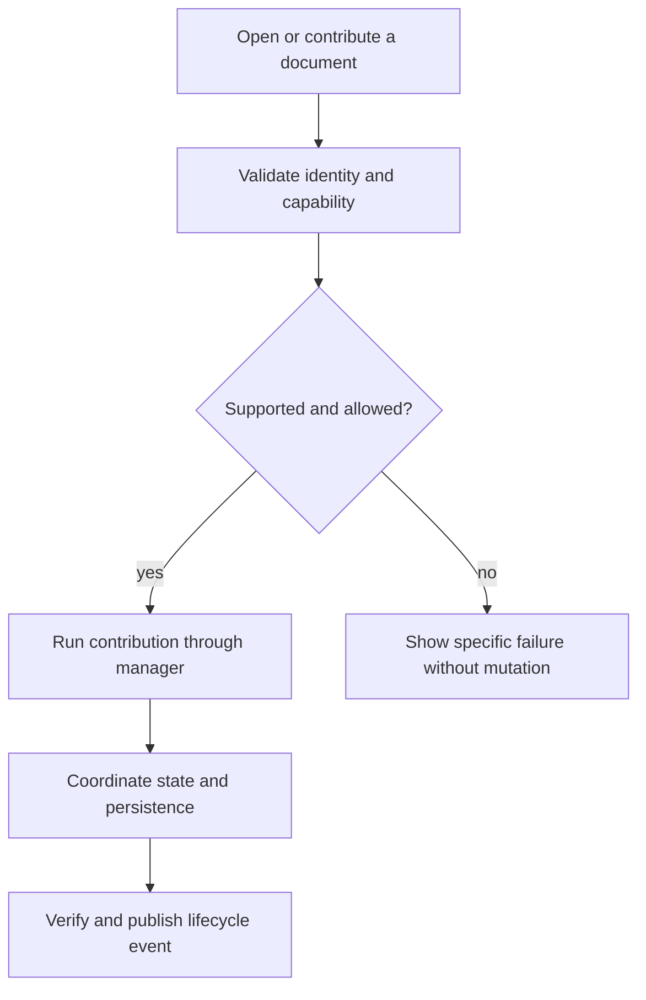
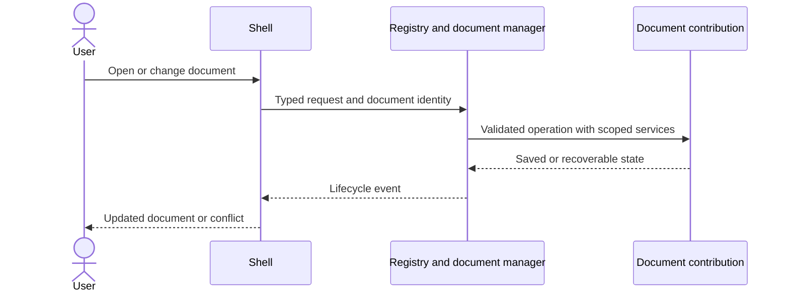

# 04 - Manage documents and organized note documents

## Mental Model & Invariants

A separate note document contains multiple organized notes. Existing GenOffice editors stay intact. New behavior attaches through OfficeBay contributions. Conforms to `docs/design/notebook-contract.md`, `document-manager.md` and `data-architecture.md`. This is a DRAFT implementation plan; no new feature is claimed implemented.

## Requirements

- R1: WHEN documents open or close, the manager SHALL coordinate typed document handles, dirty state and lifecycle through contributions while delegating existing formats unchanged.
- R2: WHEN a note document is created, it SHALL contain multiple organized notes with stable IDs, ordered sections and explicit page references.
- R3: WHEN notes are renamed, reordered, moved, duplicated or deleted, identity/reference and recovery semantics SHALL be explicit and validated.
- R4: WHEN catalog/page persistence fails or another writer changes the base, the manager SHALL preserve recoverable work and expose the conflict.
- R5: WHEN project/chat/search/history/agent consumers observe changes, they SHALL use stable document/note identities rather than reconstructing ownership from titles or tab IDs.

## Out of Scope

Excalidraw decoding and notebook canvas editing, white-labeling, native OneNote storage and untrusted dynamically downloaded plugins. No replacement project/chat store and no modifications to existing editor internals.

## Design

### End-to-End Walkthrough

The user opens a note document with several sections and notes, adds and reorders notes, switches between notes and an existing workbook, then saves and reopens the organized structure. The manager preserves stable identities and unsaved work.

### Components and State

The named design anchors own the cross-cutting contracts. This sprint tests lifecycle/catalog behavior with a fixture document contribution and opaque page references; the MDLayers codec is supplied later, so document management does not depend on a not-yet-built canvas editor. New OfficeBay packages implement these responsibilities; exact package names are settled in baseline. The host bridge is a bounded integration surface, not permission to refactor all format apps. New catalogs and identity schemas are reviewed before implementation. Existing documents remain in their original formats.

### Workflow



### Sequence



### Algorithm

```text
open aggregate catalog and validate all stable identities
resolve selected note to its referenced page
mutate hierarchy in memory using expected catalog base
persist new page before adding its catalog reference
on stale catalog: preserve page and show conflict
publish saved event with document ID and affected note IDs
```

### Configuration and Verification

Contribution lists/package versions are devtime inputs. Document roots, session preferences and allowed reference locations are runtime settings owned by the manager/host adapter. Do not add secrets. Use typed boundary schemas and trace operation IDs through UI, command, persistence and events. Test source-level legacy isolation as well as real open/save/close journeys.

## Tasks and Acceptance

- [ ] **T1 (R1).** Implement generic lifecycle handles and capability dispatch using the extension registry; add legacy-entry-point adapters outside the existing editors.
  Acceptance: Open/duplicate-open/save/close/cancel tests cover new and old types; existing format behavior is retained.
- [ ] **T2 (R2).** Specify and implement note-document catalog schema and section/note navigation model, with relative page references and standalone-page import behavior.
  Acceptance: Create multiple sections/notes, restart and restore exact order/identity; schema errors and missing pages remain recoverable.
- [ ] **T3 (R3).** Implement hierarchy operations and explicit duplicate/delete policies; enforce ID uniqueness and valid ownership.
  Acceptance: Rename does not change note identity; duplicate gets new IDs; invalid parent/cycle and dangling reference tests pass.
- [ ] **T4 (R4).** Prototype catalog/page save ordering, orphan recovery, multi-window conflict checks and Save As of a complete note document.
  Acceptance: Inject failure between page creation and catalog publication; recover without losing an existing note or silently overwriting changes.
- [ ] **T5 (R5).** Connect existing project/chat APIs and document lifecycle events; define derived search and history/agent consumers.
  Acceptance: Rename/move preserves identity; note selection scopes events correctly; no second project/chat store is created.
- [ ] Review requirements-to-task coverage, permitted legacy edits, state lifecycle, failure recovery and the real user walkthrough. Update parity evidence before closing.
