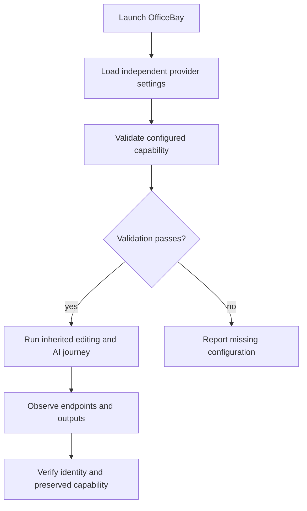
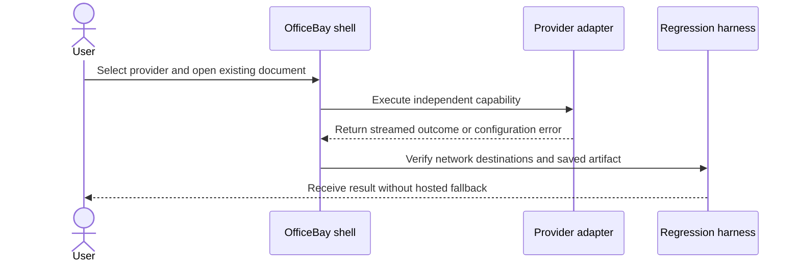

# 05 - White-label and remove hosted-provider dependency

## Mental Model & Invariants

Conforms to `docs/design/notebook-contract.md`. Add a separate OneNote-like notebook using Excalidraw-based pages and one shared MDLayers core; preserve existing document editors and user files. The owner selected that frame on 2026-09-21. This sprint remains DRAFT until its baseline dependencies and implementation design are ready.

Pillars advanced: P1, P7. Canonical shared-state rules: `docs/design/data-architecture.md`. Source-grounded capability inventory: `docs/design/feature-parity.md`.

## Requirements

- **R1:** WHEN AI runs, the suite SHALL use the selected independent provider and SHALL NOT fall back to the removed service.
- **R2:** WHEN built or displayed, product identity SHALL be OfficeBay while provenance is retained in its designated records.
- **R3:** WHEN a hosted capability is replaced, its parity row SHALL retain an equivalent tested user outcome.

## Out of Scope

No notebook feature code, document-model migration or unrelated editor refactor.

## Design

### End-to-End Walkthrough

The user launches OfficeBay, configures an independent provider, and uses the existing editors. No request silently reaches the original hosted service. Missing configuration produces a useful error while local editing remains available.

### Ownership and Configuration

Reuse existing provider settings and secret handling. Identity/update policy is deploy-time packaging config; provider choice remains runtime.

All production boundaries require typed validation. Existing source locations are candidates grounded in the baseline, not permission for broad edits. Each implementation task records its exact source paths and tests before writing. Shared state conforms to the anchor rather than maintaining a second schema here.

### Workflow



### Sequence



### Algorithm

```text
for each original-service caller: replace through provider seam or flag unresolved parity
remove fallback and auth/dependency path together
run endpoint guard + network journey + inherited regression
fail closure if any required capability was merely deleted
```

### Failure and Verification

No task may turn an untested compatibility claim into a passing result. Use non-private fixtures and scratch documents. Include stale input, missing dependencies, malformed data, cancellation or interrupted writes wherever the boundary applies. Code changes use relevant unit/integration checks plus the real host journey; documentation-only analysis uses source and graph validation.

## Tasks and Acceptance

- [ ] **T1 - remove (R1).** Trace and remove original auth, cloud-project, search/image/transcription/slide-generation paths and their callers; map an independent replacement for each affected capability.
  Acceptance: Incomplete configuration fails visibly; endpoint/dependency scan and network-observed journeys prove no original-service traffic.
- [ ] **T2 - identity (R2).** Make replayable package-scope and branding changes; inventory every existing-app edit as branding/provider removal; update packaging, icons, translations and update/analytics policy.
  Acceptance: Build artifacts and UI show OfficeBay; license records preserved; no ordinary editor model changes.
- [ ] **T3 - regression (R3).** Run baseline fixtures across all existing document types and independent AI paths; record replacement limitations as blockers, not completed removal.
  Acceptance: No affected capability silently disappears; tests include provider errors and cancellation.

- [ ] **Review gate.** Reconcile requirements - tasks - evidence and check S1-S13/Q1-Q7 as applicable. Record each deviation; update the parity matrix, guides and pillar facts. Close only after its own walkthrough and failure checks pass.
