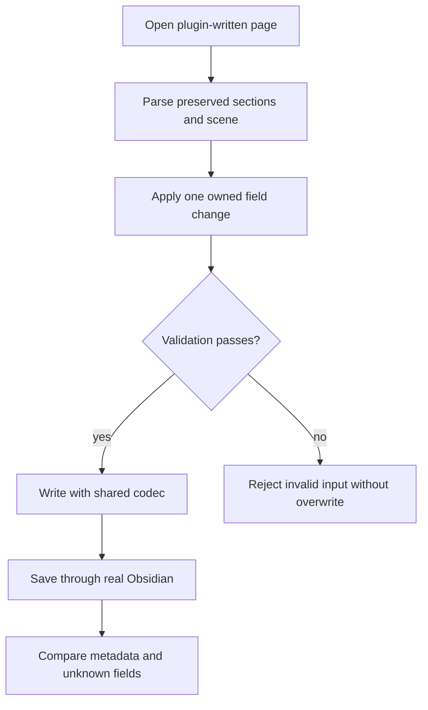
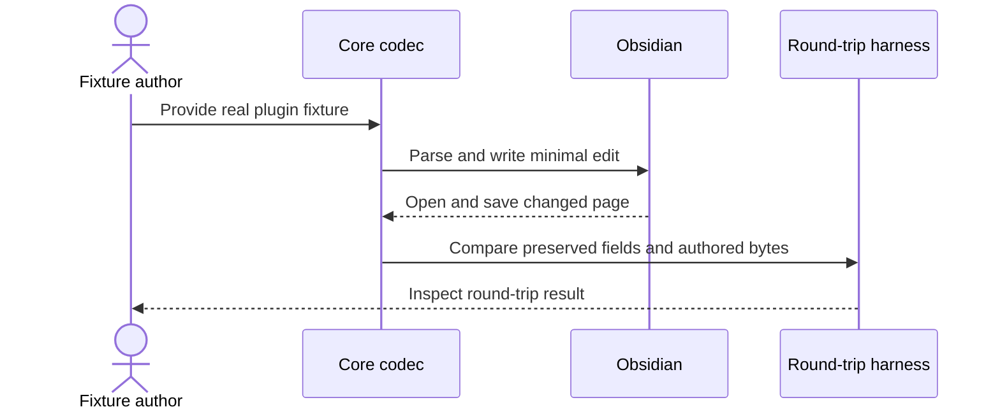

# 06 - Prove the shared MDLayers container

## Mental Model & Invariants

Conforms to `docs/design/notebook-contract.md`. Add a separate OneNote-like notebook using Excalidraw-based pages and one shared MDLayers core; preserve existing document editors and user files. The owner selected that frame on 2026-09-21. This sprint remains DRAFT until its baseline dependencies and implementation design are ready.

Pillars advanced: P3, P6. Canonical shared-state rules: `docs/design/data-architecture.md`. Source-grounded capability inventory: `docs/design/feature-parity.md`.

## Requirements

- **R1:** WHEN a supported page is read/written, the codec SHALL preserve untouched bytes and unknown fields.
- **R2:** WHEN another host saves a page, layer and identity metadata SHALL survive or adoption SHALL stop for redesign.
- **R3:** WHEN consumed by OfficeBay, the shared core SHALL be pinned and independent of host APIs.

- **R5:** WHEN the core is built, source-derived codec behavior SHALL be proven against pinned plugin fixtures and shared by all consuming hosts.

## Out of Scope

No notebook editor, ink capture, native OneNote codec or copying restricted plugin source.

## Design

### End-to-End Walkthrough

A page saved by Obsidian is read by the shared core, edited minimally, and saved back. Opening and saving it in Obsidian retains layers, links and unknown data. OfficeBay consumes the same versioned package used by the other hosts.

### Ownership and Configuration

Core/package versions and plugin fixture versions are devtime inputs. Host IO remains an adapter; no new secrets or storage service.

All production boundaries require typed validation. Existing source locations are candidates grounded in the baseline, not permission for broad edits. Each implementation task records its exact source paths and tests before writing. Shared state conforms to the anchor rather than maintaining a second schema here.

### Workflow



### Sequence



### Algorithm

```text
parse original bytes into preserved sections + validated scene view
apply requested semantic change
replace only changed sections; keep unknown data
if no change: return original bytes
```

### Failure and Verification

No task may turn an untested compatibility claim into a passing result. Use non-private fixtures and scratch documents. Include stale input, missing dependencies, malformed data, cancellation or interrupted writes wherever the boundary applies. Code changes use relevant unit/integration checks plus the real host journey; documentation-only analysis uses source and graph validation.

## Tasks and Acceptance

- [ ] **T1 - codec (R1).** Implement the codec once in the MDLayers repository: both heading generations, JSON/compressed JSON, fences, references, frontmatter, sections and unknown element data.
  Acceptance: Unchanged fixture is byte-identical; one-field edit changes only owned sections; malformed input never overwrites the source.
- [ ] **T2 - roundtrip (R2).** Generate non-private fixtures with the shipping Obsidian plugin; execute core - Obsidian - core and reverse round trips, including hidden/unknown elements.
  Acceptance: Recorded real save diff retains layer table, membership, embedded-file mappings and unknown data.
- [ ] **T3 - package (R3).** Publish or produce a reproducible pinned package artifact from MDLayers; add dependency and contract tests here without copying its implementation.
  Acceptance: Pure codec/model graph has no DOM/Electron/Obsidian/VS Code/filesystem imports; clean install resolves the same version.

- [ ] **T5 - reference adaptation (R5).** Apply editor-adaptation to the Obsidian Excalidraw container and engine boundary; prototype optional history locator preservation, detached page opening and bundled track export.
  Acceptance: No-op/changed-section round trips preserve links, embeds and unknown fields; absence of history does not prevent page editing; no duplicate host codec.

- [ ] **Review gate.** Reconcile requirements - tasks - evidence and check S1-S13/Q1-Q7 as applicable. Record each deviation; update the parity matrix, guides and pillar facts. Close only after its own walkthrough and failure checks pass.
