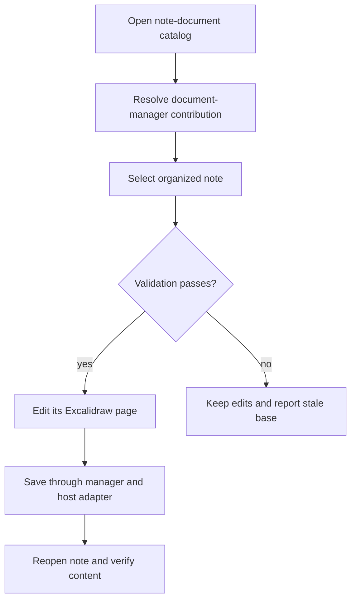
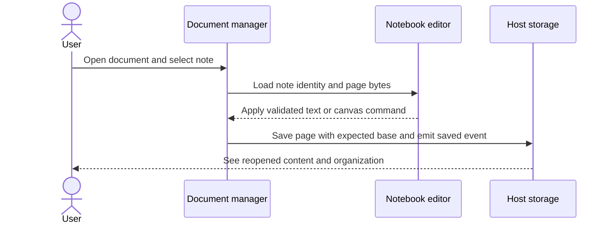

# 07 - Add the separate notebook document type

## Mental Model & Invariants

Conforms to `docs/design/notebook-contract.md`. Add a separate OneNote-like notebook using Excalidraw-based pages and one shared MDLayers core; preserve existing document editors and user files. The owner selected that frame on 2026-09-21. This sprint remains DRAFT until its baseline dependencies and implementation design are ready.

Pillars advanced: P1, P3, P6. Canonical shared-state rules: `docs/design/data-architecture.md`. Source-grounded capability inventory: `docs/design/feature-parity.md`.

## Requirements

- **R1:** WHEN a notebook page opens, the shell SHALL route it to a separate notebook app while preserving every existing format route.
- **R2:** WHEN users edit a notebook, supported text/canvas operations SHALL satisfy the approved parity rows.
- **R3:** WHEN users print/export/present, authored notebook content SHALL remain faithful to the selected page bounds and output contract.
- **R4:** WHEN a save races an external change or fails, the notebook SHALL retain recoverable user work.

- **R5:** WHEN notebook text/rendering surfaces are implemented, the approved UI and measured Cherry/MPE adaptation decisions SHALL govern the new contribution.

## Out of Scope

No edits to existing editor implementations for notebook features. No source-note conversion. Advanced layer tools, durable history and AI follow their own sprints.

## Design

### End-to-End Walkthrough

The user creates a notebook, adds sections and pages, types formatted text on a page, places media and references, saves, closes and reopens it. A normal Markdown or Office document still opens in its original editor.

### Ownership and Configuration

Notebook user preferences are runtime in the notebook subtree. Core is pinned at devtime; UI uses shared tokens/i18n. Use the catalog and persistence contracts delivered by the document manager; do not implement a second catalog.

All production boundaries require typed validation. Existing source locations are candidates grounded in the baseline, not permission for broad edits. Each implementation task records its exact source paths and tests before writing. Shared state conforms to the anchor rather than maintaining a second schema here.

### Workflow



### Sequence



### Algorithm

```text
route compound notebook suffix before generic markdown
load page using core; resolve references through host policy
edit working model through validated commands
compare opened base; save with host primitive; verify
on stale base: keep working state and offer conflict recovery
```

### Failure and Verification

No task may turn an untested compatibility claim into a passing result. Use non-private fixtures and scratch documents. Include stale input, missing dependencies, malformed data, cancellation or interrupted writes wherever the boundary applies. Code changes use relevant unit/integration checks plus the real host journey; documentation-only analysis uses source and graph validation.

## Tasks and Acceptance

- [ ] **T1 - register (R1).** Register `apps/notebook` through the extension mechanism and document manager; contribute file association, create/open commands, view and build assets without another legacy dispatch edit.
  Acceptance: Compound suffix routing, duplicate-open, dirty-close, Save As, rename and recent-file journeys pass; original app routes unchanged.
- [ ] **T2 - edit (R2).** Bind the document manager's section/note navigation to the editor; implement rich text, tables, lists, links, math, shapes, media, clipboard, undo/redo and search using reusable engines behind notebook-owned adapters.
  Acceptance: Each operation saves/reopens without flattening or undocumented loss; unsupported imported content is preserved and visibly identified.
- [ ] **T3 - outputs (R3).** Implement approved import/export and presentation paths, theme/language integration and accessible keyboard focus; reuse shared services without importing an existing app renderer.
  Acceptance: Theme does not change exported document colors; page/selection bounds and referenced assets verified on exported artifacts.
- [ ] **T4 - save (R4).** Use document-manager expected-base coordination and host persistence for autosave/Save As/recovery; preserve the manager's document/note identities.
  Acceptance: Read-only files, stale base, missing dependencies and interrupted writes produce no silent overwrite.

- [ ] **T5 - editor adaptation and UI (R5).** Measure Cherry syntax/menu/edit-preview behavior and MPE/Crossnote rendering/export seams; implement selected patterns in new notebook cards and shared browser services. Review U01 design states.
  Acceptance: Tables, math, images, selection/undo and exports have proving fixtures; existing editors remain unchanged; filesystem/process dependencies stay outside the pure core.

- [ ] **Review gate.** Reconcile requirements - tasks - evidence and check S1-S13/Q1-Q7 as applicable. Record each deviation; update the parity matrix, guides and pillar facts. Close only after its own walkthrough and failure checks pass.
