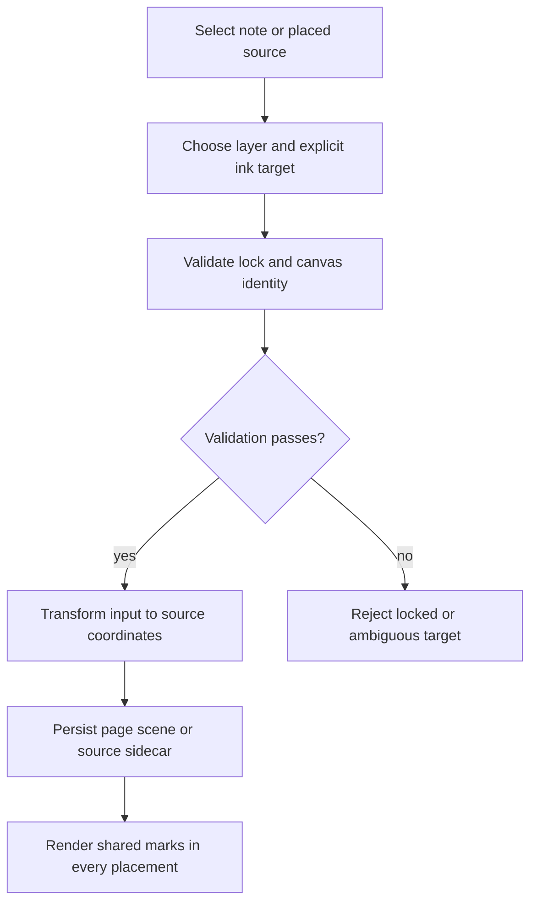
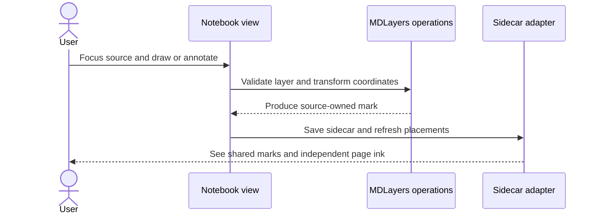

# 08 - Deliver MDLayers behavior in the notebook

## Mental Model & Invariants

Conforms to `docs/design/notebook-contract.md`. Add a separate OneNote-like notebook using Excalidraw-based pages and one shared MDLayers core; preserve existing document editors and user files. The owner selected that frame on 2026-09-21. This sprint remains DRAFT until its baseline dependencies and implementation design are ready.

Pillars advanced: P1, P3. Canonical shared-state rules: `docs/design/data-architecture.md`. Source-grounded capability inventory: `docs/design/feature-parity.md`.

## Requirements

- **R1:** WHEN a layer is hidden or locked, visibility SHALL not erase data and lock state SHALL govern every mutation path.
- **R2:** WHEN a source is moved/scaled/embedded twice, its marks SHALL stay in its source coordinates.
- **R3:** WHEN external source text changes, ink/review codecs SHALL preserve unknown data and expose stale or orphaned anchors.
- **R4:** WHEN users write with pen or mouse, pressure, drawing, smoothing and erasing SHALL persist with usable input behavior.

- **R5:** WHEN ink is recorded, accepted input SHALL preserve pressure, source coordinates and monotonic per-point timing before geometry simplification.

## Out of Scope

No modifications to the existing Markdown editor. No silent reanchoring of ambiguous text, source content conversion or duplicated sidecar store.

## Design

### End-to-End Walkthrough

The user places the same marked note or PDF page twice, adds ink and comments, hides a layer, and moves one placement. The two placements share source marks while page ink stays on the page. Reopening in another host retains the data.

### Ownership and Configuration

Layer visibility/mode and input preferences are runtime; coordinate-space versions are schema constants, not tunables.

All production boundaries require typed validation. Existing source locations are candidates grounded in the baseline, not permission for broad edits. Each implementation task records its exact source paths and tests before writing. Shared state conforms to the anchor rather than maintaining a second schema here.

### Workflow



### Sequence



### Algorithm

```text
canvas = explicit focused source or page
validate kind and unlocked layer
transform input into canvas coordinates
write source-owned sidecar or page-owned scene
render each placement through composed transforms; never bake screen coordinates into storage
```

### Failure and Verification

No task may turn an untested compatibility claim into a passing result. Use non-private fixtures and scratch documents. Include stale input, missing dependencies, malformed data, cancellation or interrupted writes wherever the boundary applies. Code changes use relevant unit/integration checks plus the real host journey; documentation-only analysis uses source and graph validation.

## Tasks and Acceptance

- [ ] **T1 - layers (R1).** Implement named/ordered/toggleable/locked layers, layer panel, mode visibility and extensible mark-kind registration with unknown-kind fallback.
  Acceptance: Save/reopen retains hidden data; UI and later agent commands reject locked edits; third-party kind round trip passes.
- [ ] **T2 - coordinates (R2).** Implement canvas IDs, nested placement composition, PDF-page/image identity, layoutWidth and explicit focused-source versus page input targeting.
  Acceptance: Ink follows its source under resize; page ink does not follow a moved source; source text wrap width is stable for fixed-coordinate ink.
- [ ] **T3 - sidecars (R3).** Implement independent Handwriting-compatible and MRSF codecs, highlight/comment anchoring, search/display of source marks and the section-9 MDLayers probes.
  Acceptance: Rename/hash, image surface, text edits before/inside anchor, missing source and duplicate placement fixtures pass.
- [ ] **T4 - capture (R4).** Implement reusable browser capture/render layer; measure Windows input and accessibility; verify presentation/annotation views share the model.
  Acceptance: Record real device behavior and deterministic stroke geometry/erase tests; no claim of iPad parity from desktop tests.

- [ ] **T5 - replay-ready layer events (R5).** Independently adapt measured Handwriting capture/sidecar behavior and Sidemark anchoring; expose accepted layer/ink/erase/transform/undo events under replay.md.
  Acceptance: Timed synthetic and Windows pen fixtures survive serialization; legacy timing is validated and coverage declared; layer locks reject mutations; no invented times for geometry-only strokes.

- [ ] **Review gate.** Reconcile requirements - tasks - evidence and check S1-S13/Q1-Q7 as applicable. Record each deviation; update the parity matrix, guides and pillar facts. Close only after its own walkthrough and failure checks pass.
