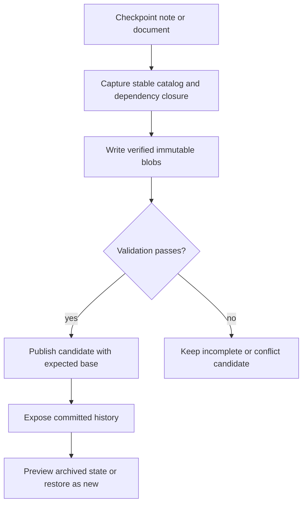
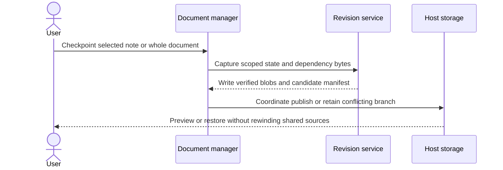

# 09 - Add durable notebook history and conflict recovery

## Mental Model & Invariants

Conforms to `docs/design/notebook-contract.md`. Add a separate OneNote-like notebook using Excalidraw-based pages and one shared MDLayers core; preserve existing document editors and user files. The owner selected that frame on 2026-09-21. This sprint remains DRAFT until its baseline dependencies and implementation design are ready.

Pillars advanced: P1, P3. Canonical shared-state rules: `docs/design/data-architecture.md`. Source-grounded capability inventory: `docs/design/feature-parity.md`.

## Requirements

- **R1:** WHEN a complete checkpoint is recorded, the manifest SHALL identify immutable page, sidecar and local dependency bytes.
- **R2:** WHEN a user previews or restores, history SHALL survive restart and restoration SHALL create a new revision.
- **R3:** WHEN writers diverge or sync is incomplete, competing revisions SHALL remain recoverable.
- **R4:** WHEN history is pruned, retained revisions and unresolved conflicts SHALL keep all referenced blobs.

- **R5:** WHEN a checkpoint targets the note document, its catalog, section/note membership and ordering SHALL be captured; a single-note checkpoint SHALL declare its narrower scope.

## Out of Scope

No native `.one` codec, CRDT/live collaboration or byte-level OneNote storage reproduction.

## Design

### End-to-End Walkthrough

The user checkpoints a page, changes a linked note and adds ink, then previews the older checkpoint. Preview shows archived dependencies. Restoring creates a new revision and does not rewind source documents shared with other pages.

### Ownership and Configuration

History capture cadence/quota/pruning are runtime settings owned by notebook history. Start with explicit checkpoints and no automatic pruning; measure timed capture defaults.

All production boundaries require typed validation. Existing source locations are candidates grounded in the baseline, not permission for broad edits. Each implementation task records its exact source paths and tests before writing. Shared state conforms to the anchor rather than maintaining a second schema here.

### Workflow



### Sequence



### Algorithm

```text
capture stable page + dependency closure
write verified immutable blobs and candidate manifest
coordinate local writers; compare expected base
if stale: retain candidate and expose conflict
otherwise publish and verify current page using the proven recovery protocol
preview uses archived bytes; restore creates a new child revision
```

### Failure and Verification

No task may turn an untested compatibility claim into a passing result. Use non-private fixtures and scratch documents. Include stale input, missing dependencies, malformed data, cancellation or interrupted writes wherever the boundary applies. Code changes use relevant unit/integration checks plus the real host journey; documentation-only analysis uses source and graph validation.

## Tasks and Acceptance

- [ ] **T1 - capture (R1).** Prototype and specify intent/publication/recovery ordering, stable capture and dependency closure; implement full snapshots with digest deduplication and visible non-dot storage.
  Acceptance: Manifest cannot appear complete with missing blobs; changing dependency during capture is detected; external unpinned content is labeled partial.
- [ ] **T2 - history (R2).** Implement history panel, before/after preview, restore-as-new and dependency-copy semantics; distinguish undo, history and agent activity.
  Acceptance: Archived preview is reproducible; restore leaves former head retained and shared sources unchanged.
- [ ] **T3 - conflicts (R3).** Test two hosts, non-cooperating editors, delayed/out-of-order blob delivery and sync conflict copies; implement visible branch/incomplete states and explicit resolution.
  Acceptance: No latest-timestamp winner silently discards work; local file replacement is not reported as distributed atomicity.
- [ ] **T4 - retention (R4).** Measure checkpoint size/time on large media; implement explicit retention preview and reachability-safe pruning only after recovery tests.
  Acceptance: Crash injection at each boundary is recoverable; no automatic deletion by default; restore of retained revisions passes.

- [ ] **T5 - aggregate history (R5).** Implement note-document versus single-note checkpoints through document-manager identities and catalog persistence.
  Acceptance: Restore a document with renamed/reordered/deleted notes; verify catalog membership and retained history. Restoring one note leaves other notes and shared sources unchanged.

- [ ] **Review gate.** Reconcile requirements - tasks - evidence and check S1-S13/Q1-Q7 as applicable. Record each deviation; update the parity matrix, guides and pillar facts. Close only after its own walkthrough and failure checks pass.
