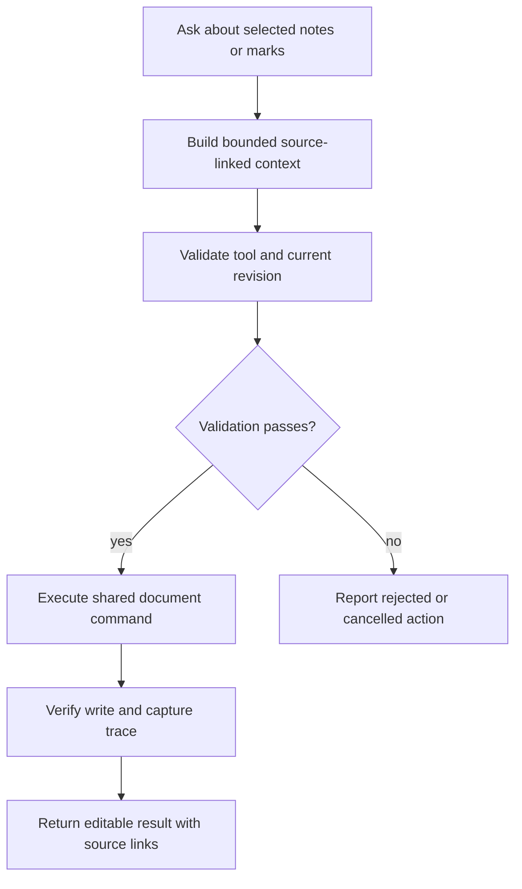
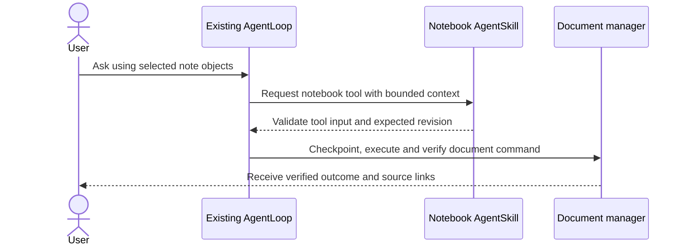

# 10 - Reach notebook AI and workflow parity

## Mental Model & Invariants

Conforms to `docs/design/notebook-contract.md`. Add a separate OneNote-like notebook using Excalidraw-based pages and one shared MDLayers core; preserve existing document editors and user files. The owner selected that frame on 2026-09-21. This sprint remains DRAFT until its baseline dependencies and implementation design are ready.

Pillars advanced: P2, P4, P5, P7. Canonical shared-state rules: `docs/design/data-architecture.md`. Source-grounded capability inventory: `docs/design/feature-parity.md`.

## Requirements

- **R1:** WHEN notebook AI runs, it SHALL use existing AgentLoop/provider/project-chat owners and a notebook-specific AgentSkill.
- **R2:** WHEN a tool changes content, it SHALL use the same validation, layer locks and persistence guards as user commands.
- **R3:** WHEN AI uses referenced documents or creates output, provenance and extraction limits SHALL remain inspectable.
- **R4:** WHEN hosted-service capabilities were replaced, the notebook SHALL expose their approved independent equivalents.

## Out of Scope

No new model orchestration framework, changes to existing editor tool implementations or unrestricted disk/network tools.

## Design

### End-to-End Walkthrough

The user selects a page object or mark and asks the existing AI panel to explain or change it. The agent receives bounded notebook context, calls notebook tools, and produces a verified editable result with source links and a restorable checkpoint.

### Ownership and Configuration

Reuse runtime provider config and secret references. Notebook tool limits/prompts belong to the notebook component; record effective non-secret run settings and source revision.

All production boundaries require typed validation. Existing source locations are candidates grounded in the baseline, not permission for broad edits. Each implementation task records its exact source paths and tests before writing. Shared state conforms to the anchor rather than maintaining a second schema here.

### Workflow



### Sequence



### Algorithm

```text
build bounded context from selected page/objects and allowed references
validate tool input and expected revision
checkpoint before mutation
execute shared notebook command; verify persisted result
record tool outcome and source links; report failure without claiming success
```

### Failure and Verification

No task may turn an untested compatibility claim into a passing result. Use non-private fixtures and scratch documents. Include stale input, missing dependencies, malformed data, cancellation or interrupted writes wherever the boundary applies. Code changes use relevant unit/integration checks plus the real host journey; documentation-only analysis uses source and graph validation.

## Tasks and Acceptance

- [ ] **T1 - reuse (R1).** Wire context, streaming, cancellation, attachments, provider errors and chat identity through the existing contracts; use the agentic-system-dev preflight against these concrete owners.
  Acceptance: No parallel agent runtime or notebook credential store; cancellation and malformed tool input journeys pass.
- [ ] **T2 - tools (R2).** Enumerate all AI parity commands from the baseline; implement read/locate/create/edit/mark and cross-page scoped tools with schema validation and pre-mutation revisions.
  Acceptance: Unauthorized references, stale state, locked layers and invalid shapes are rejected without partial writes; effects match reported results.
- [ ] **T3 - grounding (R3).** Add source/page/object/revision links, bounded image context, extraction-quality reporting and output opening through existing format APIs; use existing transformation engine only where the workflow needs it.
  Acceptance: One selected-mark - editable artifact journey passes with trace and inspectable lineage; no fabricated extraction.
- [ ] **T4 - parity (R4).** Run provider/search/image/transcription/generation checks applicable to notebook workflows; refresh every G09-G12/G15 row.
  Acceptance: All scoped rows have executed outcomes, including failure/cancel paths; missing replacements block closure.

- [ ] **Review gate.** Reconcile requirements - tasks - evidence and check S1-S13/Q1-Q7 as applicable. Record each deviation; update the parity matrix, guides and pillar facts. Close only after its own walkthrough and failure checks pass.
