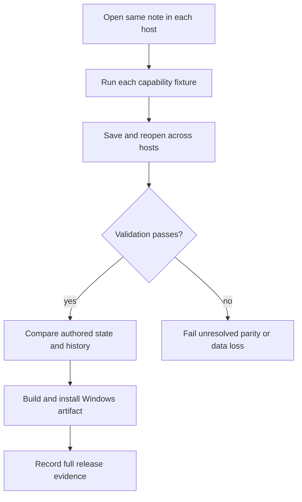
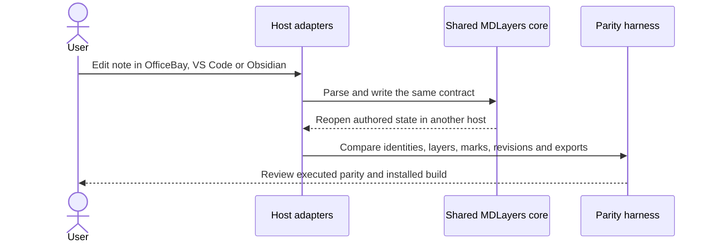

# 11 - Verify host reuse and complete parity

## Mental Model & Invariants

Conforms to `docs/design/notebook-contract.md`. Add a separate OneNote-like notebook using Excalidraw-based pages and one shared MDLayers core; preserve existing document editors and user files. The owner selected that frame on 2026-09-21. This sprint remains DRAFT until its baseline dependencies and implementation design are ready.

Pillars advanced: P1, P2, P3, P6, P7. Canonical shared-state rules: `docs/design/data-architecture.md`. Source-grounded capability inventory: `docs/design/feature-parity.md`.

## Requirements

- **R1:** WHEN each host consumes the notebook model, it SHALL use the same pinned MDLayers core and file contracts.
- **R2:** WHEN history travels across hosts, its completeness and restoration guarantees SHALL remain visible.
- **R3:** BEFORE calling the notebook complete, every GenOffice/MDLayers parity row SHALL have executed evidence or an owner-approved disposition.
- **R4:** WHEN shipped, the Windows artifact SHALL contain the separate notebook and retain existing editors without regression.

## Out of Scope

No upstream rebase, unrelated editor improvements, native OneNote import/export or live collaboration.

## Design

### End-to-End Walkthrough

The user edits the same page through OfficeBay, VS Code and Obsidian, then reopens it in OfficeBay. Layers, links and source marks survive. The installed Windows build still opens and edits existing Office and Markdown documents normally.

### Ownership and Configuration

Host package/core versions are devtime locked; host-specific runtime preferences stay in each adapter. No new deployment service.

All production boundaries require typed validation. Existing source locations are candidates grounded in the baseline, not permission for broad edits. Each implementation task records its exact source paths and tests before writing. Shared state conforms to the anchor rather than maintaining a second schema here.

### Workflow



### Sequence



### Algorithm

```text
for each parity row: resolve source, owner, test, artifact and outcome
for each host pair: edit - save - reopen - compare authored state
if any unresolved row or lost data: fail full-parity release
build and install; verify inherited routes and notebook journeys
```

### Failure and Verification

No task may turn an untested compatibility claim into a passing result. Use non-private fixtures and scratch documents. Include stale input, missing dependencies, malformed data, cancellation or interrupted writes wherever the boundary applies. Code changes use relevant unit/integration checks plus the real host journey; documentation-only analysis uses source and graph validation.

## Tasks and Acceptance

- [ ] **T1 - hosts (R1).** Implement thin VS Code page/note adapters and Obsidian companion integration in their owning repositories; verify normal Markdown editing remains host-owned.
  Acceptance: Real cross-host saves preserve unknown data, layers, marks and references; no copied core implementations.
- [ ] **T2 - revisions (R2).** Test adapter participation and external-editor changes; specify which hosts capture revisions and surface missing history explicitly.
  Acceptance: Unsupported host history capture never implies complete keystroke history; shared checkpoint preview/restore fixtures pass.
- [ ] **T3 - fullparity (R3).** Expand and close all individual baseline rows; test format-specific embed/open/edit/return, output fidelity, source annotations, pen, accessibility and language/theme behavior.
  Acceptance: No unresolved parity row, hidden reduction in scope or unmeasured feature marked passed.
- [ ] **T4 - release (R4).** Build/install cleanly, run all affected tests and real journeys, inspect exported outputs, update guides and reconcile the allowed upstream diff.
  Acceptance: No notebook-driven changes in existing editor implementations; network guard passes; clone/install/launch and inherited journeys recorded.

- [ ] **Review gate.** Reconcile requirements - tasks - evidence and check S1-S13/Q1-Q7 as applicable. Record each deviation; update the parity matrix, guides and pillar facts. Close only after its own walkthrough and failure checks pass.
